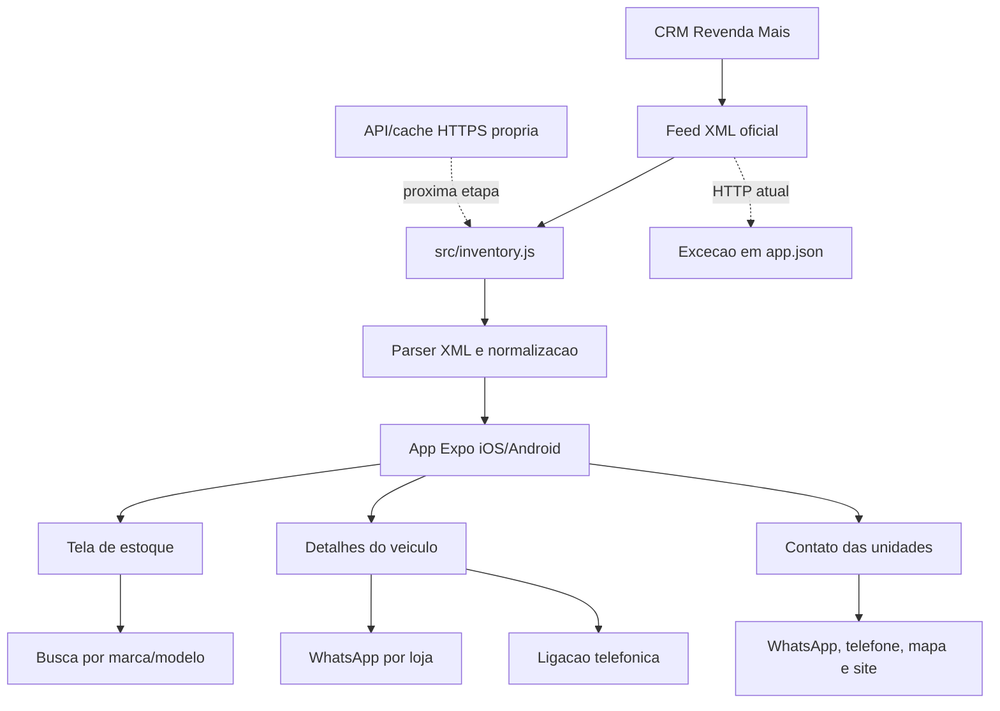

# Squ4ttro Motors App

Aplicativo Expo para iOS e Android com estoque pesquisavel, fotos reais dos veiculos e contatos rapidos da Squ4ttro Motors.

## Estoque oficial

O app busca o estoque no feed XML do Revenda Mais:

```text
http://app.revendamais.com.br/application/index.php/apiGeneratorXml/generator/sitedaloja/4e24bb8b9bfec5a702ee95ca0d7b84987561.xml
```

Esse feed alimenta marca, modelo, ano, km, preco, cambio, combustivel, loja, endereco, opcionais e fotos. Como o feed esta em HTTP, `app.json` inclui excecao de trafego claro para `app.revendamais.com.br` em iOS e Android. Para publicacao final, o melhor caminho e expor esse mesmo estoque por uma API/cache HTTPS propria.

## Grafo atual



## Rodar localmente

```bash
npm start
```

Depois, abra no Expo Go ou use:

```bash
npm run android
npm run ios
```

## Previa no navegador

```bash
npm run web
```

A previa web pode cair na amostra salva porque navegadores podem bloquear a leitura direta do feed por CORS. Nos apps Android e iOS, a requisicao nativa busca o estoque completo no Revenda Mais.

## Build para lojas

O projeto usa Expo SDK 56. Para gerar builds de distribuicao, configure uma conta Expo/EAS e rode:

```bash
npx eas build --platform android
npx eas build --platform ios
```
